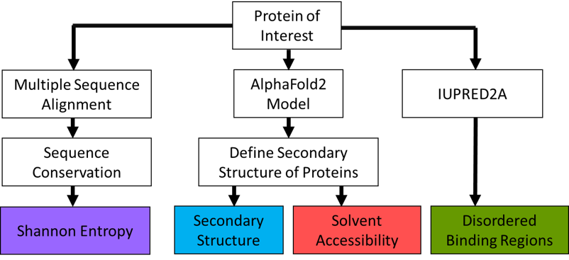
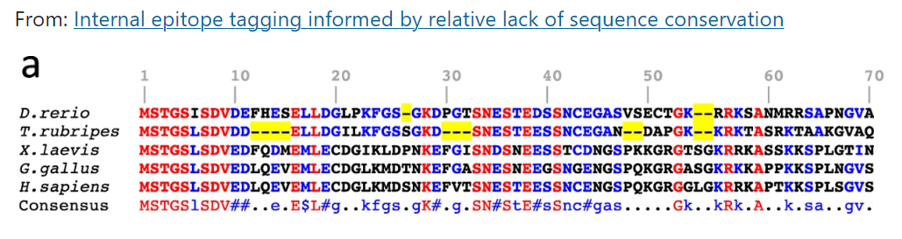
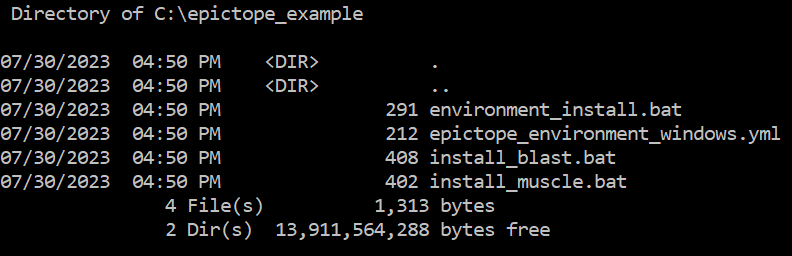

# Epictope

Software for predicting epitope tag insertion sites in proteins.

Epictope is an R pipeline to identify epitope tag insertion sites for proteins of interest. It uses four features of protein structure; sequence conservation, secondary structure, disordered binding regions, and relative solvent accessabilty to predict suitable internal locations for tag insertion.

This repository contains the code source of the R Epictope package, step-by-step R Markdown and Jupyter notebooks to run the complete workflow, wrapped scripts for simplified workflow executation, and instructions to adjust the weight and effect of each considered feature. The package requires local installations of BLAST, MUSCLE, and DSSP to run (those can be installed as a package with Epictope). You will need at least 3GB of disk space.

## Table of Contents
- [Methodology](#methodology)
- [Dependencies](#dependencies)
- [Installation](#installation)
- [Usage](#usage)

## Methodology

<figure style="display: inline-block; text-align: center;">
  
  <figcaption>Epictope workflow. Starting from a protein of interest, the Epictope workflow automates multiple sequence alignment, downloading of predicted protein structure from AlphaFold2, and fetching disordered binding regions from IUPred2A.</figcaption>.
</figure>


### Sequence conservation

Sequence conservation is used to guide internal epitope-tagging approaches. Regions of relatively low conservation are unlikely to be involved in the critical function of the protein. To identify these regions for a protein of interest, we first BLAST the query protein against the proteomes of a diverse set of model organisms. By default, we compare the query sequence against the proteomes of _Mus musculus_ (mouse), _Bos taurus_ (cow), _Canis lupus familiaris_ (dog), Gallus gallus (chicken), _Homo sapiens_ (human), _Takifugu rubripes_ (pufferfish), and _Xenopus tropicalis_ (western clawed frog). Using BLAST, we identify the highest scoring match in each organism, sorted by the lowest E-value. We then align the retrieved sequences with the query protein using MUSCLE, a multiple sequence alignment program, and calculate the shannon entropy at each position. We use [Shannon entropy](https://en.wikipedia.org/wiki/Entropy_(information_theory)) as a simple measure of the calculate the variability of amino acids at each position in the alignment. A lower Shannon entropy indicates low variability, or high sequence conservation at the position, and it should therefore be avoided for tag insertion. Conversly, a high Shannon entropy indicates a relatively low degree of sequence conservation, and potential suitability for tagging.


<figure style="display: inline-block; text-align: center;">
  
  <figcaption>Example Multiple Sequence Alignment for Tcf21 protein sequences from position 1 to 70. The protein of interest or query is the tcf21 protein from Danio rerio (zebrafish). Amino acids identical between all species are in red, non-identical between at least one species in blue, and gaps are highlighted in yellow. From this alignment, red regions would be unfavorable to tag insertion.</figcaption>.
</figure>

### Solvent accessibility

 Relative Solvent Accessibility (RSA) is a measure of the surface area of a folded protein that is accessible to a solvent, typically the cytoplasmic fluid. It is calculated by dividing the solvent accessible surface area (SASA) of an amino acid by the maximum possible solvent accessible surface area for that residue. SASA values are assigned with Define Secondary Structure of Proteins (DSSP). The DSSP program defines secondary structure, geometrical features and solvent exposure of proteins, given atomic coordinates in Protein Data Bank (PDB) format. Values used for the maximum possible solvent accessible surface area were taken from [this study](https://doi.org/10.1371/journal.pone.0080635). We use the [Alphafold2 predicted structure from the European Bioinformatics Institute (EBI)](https://alphafold.ebi.ac.uk/) as the source PDB for DSSP calculations.


### Secondary structure

Secondary structure is the local spatial conformation of the polypeptide backbone for the protein of interest. Certain structures, such as alpha helices or beta sheets, are more defined and disruption of these structure is likely to affect protein structure. As with solvent accessibility, we use DSSP to define the secondary structure of the protein from its PDB file. By default, we assign helices (GHI) and sheets (E) feature scores of 0. Hydrogen bonded turns (T), residues in isolated Beta bridges (B), and bends (S) scores of 0.5, and coils scores of 1. For all features, higher values indicate greater suitability for tag insertion. 

### Disordered binding 

Disordered binding regions are sections of a protein that do not have a well-defined structure on their own, but can undergo a disorder-to-order transition when they bind to specific protein partners. To avoid these regions, we use [ANCHOR2](https://iupred2a.elte.hu/), a tool that analyzes an amino acid sequence and returns a score of intrinsic disorder depending on a model of the estimated energy potential for residue interactions. To maintain consistency with other features, the disordered binding feature score is taken as 1 minus the ANCHOR2 score.

## Installation

### System requirements
Installing Epictope and its dependencies will require at least 3Gb of disk space. Users should also be familar with using conda, a package manager for macOS/linux and Windows. Conda does not need to be used if users already have access to installations of BLAST, MUSCLE, and DSSP, either locally or on an HPC environment. For users familiar with R, Epictope can be run interactively through an R session or with an IDE such as RStudio.

### Dependencies

To calculate the multiple sequence alignment and secondary characteristics, Epictope relies on local installs of BLAST, muscle, and dssp. These packages can be installed using conda, an open-source package management system and environment management system that runs on Windows, macOS, and Linux. Conda installers can be found at the Anaconda [website](https://www.anaconda.com/). Once installed, you may run the follow commands to install the requisite packages. These commands will create a conda environment named "epictope", and install the requisite packages into that environment. 

Installing Epictope and its dependencies will require at least 3GB of disk space. Users should also be familar with using conda, a package manager for macOS/linux and Windows. Conda does not need to be used if users already have access to  installations of BLAST, MUSCLE, and DSSP, either locally or on an HPC environment. For users familiar with R, Epictope can be run interactively through an R session or with an IDE such as RStudio. 

### Software dependencies

To calculate the multiple sequence alignment and secondary characteristics, Epictope relies on local installs of BLAST, MUSCLE, and DSSP. These packages can be installed using Conda, an open-source package management system and environment management system that runs on Windows, macOS, and Linux. Conda installers can be found at the Anaconda [website](https://www.anaconda.com/). Once installed, you may run the follow commands to install the requisite packages. These commands will create a conda environment named Epictope, and install the requisite packages into that environment. 

#### macOS/Linux installation

For macOS/Linux, commands are issued at the terminal. Dependencies can be installed using the provided [epictope_environment_linux.yml](https://github.com/henrichung/epitope_tag/blob/main/install/mac_linux/epictope_environment_linux.yml) using the following commands. Download the epictope_environment_linux.yml file and place the file in your working directory or project folder. Then use commands to install. 

```
conda env create --file=epictope_environment_linux.yml
conda activate epictope
```

Additional methods and detailed instructions for linux can be found [here](https://github.com/henrichung/epitope_tag/wiki/Detailed-Linux-Instructions)


#### Windows installation

Detailed instructions for conda installation Windows can be found at this [link](https://docs.conda.io/projects/conda/en/latest/user-guide/install/windows.html).  Once installed, run the following commands to install the R and DSSP dependencies. Dependencies can be installed using the provided [epictope_environment_windows.yml](https://github.com/henrichung/epitope_tag/blob/main/install/windows/epictope_environment_windows.yml). Download or copy-paste the contents of the epictope_environment_windows.yml file and place the file in your working directory or project folder. Then use one of the subsequent methods to install. 

BLAST and MUSCLE are not available for installation on Windows with conda. Detailed instructions for installation on Windows can be found for [BLAST](https://2018-03-06-ibioic.readthedocs.io/en/latest/install_blast.html) and [MUSCLE](https://2018-03-06-ibioic.readthedocs.io/en/latest/install_muscle.html) for MUSCLE. Similar to previous steps, we provide simple wrapper scripts to install both. We provide wrapper scripts for [blast](https://github.com/henrichung/epitope_tag/blob/main/install/windows/install_blast.bat) and [muscle](https://github.com/henrichung/epitope_tag/blob/main/install/windows/install_muscle.bat) separately.

Run the following commands in the Anaconda Prompt.
```
conda env create --file=epictope_environment_windows.yml
conda activate epictope
install_blast.bat
install_muscle.bat
```

Detailed Installation Instructions for Windows can be found [here](https://github.com/henrichung/epitope_tag/wiki/Detailed-Windows-Instructions)

### Installing Epictope 

Epictope is distributed as a R package. You can install it from this github repository using the *install_github* function from eiher the `remotes` or `devtools` R packages. This function is equivalent to the *install.packages()* function in base R, and should be entered in R through an interactive session or an IDE like RStudio.

```
# using remotes
if (!requireNamespace("remotes", quietly = TRUE)) {
    install.packages("remotes")
}
remotes::install_github("henrichung/epitope_tag")
```
```
# using devtools
if (!requireNamespace("devtools", quietly = TRUE)) {
    install.packages("devtools")
}
devtools::install_github("henrichung/epitope_tag")
```

We also provide additional resources outside the main packages, such as scripts to automate conda installation, wrapper scripts for the Epictope workflow, and detailed step-by-step workflows as R Markdown Documents and Jupyter Notebooks. These can be downloaded from this repository through the webpage, or using git. Git is available on both MacOS/Linux and Windows machines

```
git clone https://github.com/henrichung/epitope_tag
```

## Usage

#### Workflow notebooks
Example workflows with the Epictope package are available in the **vignettes** folder. Workflows are available as both [R Markdown Documents](https://rmarkdown.rstudio.com/) and [Jupyter](https://jupyter.org/) notebooks. These workflows go through the Epictope workflow step by step in an interactive session or an IDE. 

#### Macro scripts
Alternatively, the scripts `install.R` and `single_score.R` are provided in the **scripts** folder of this repo to enable one-command operation.
To run, download the `install.R` and `single_score.R` scripts from this repository either directly from the github page or using git clone.

- [install.R](https://github.com/henrichung/epitope_tag/blob/main/scripts/install.R) -
  - This script first downloads the proteomes for the species used in the multiple sequence alignment from the NCBI FTP page.
  - It then converts these sequences into usable files for BLAST.
  - This file need to be re-run if the user changes the species considered in the multiple sequence alignment.

- [single_score.R](https://github.com/henrichung/epitope_tag/blob/main/scripts/single_score.R) -
  - This script takes a UniprotID as input and performs the Epictope workflow for that protein.
  - It first retrieves the amino acid sequence and Alphafold2 predicted structure for the protein.
  - It then BLASTs the protein against the proteomes of the animals used in the multiple sequence alignment, retrieves the highest scoring match (score measured by the lowest E-value), and aligns the matched proteins along with the query in a multiple sequence alignment.
  - It then determines the secondary structure, solvent accessibility, and disordered binding regions for the protein.
  - It combines all feature scores into a dataframe.
  - The dataframe annotates each residue position with its feature scores and final tagging score.
  - This file is saved to an /outputs folder with the name of the protein followed by '_score.csv'.
  - For example, the protein used in the examples saves a "outputs/P57102_score.csv" file.


From the terminal, these scripts can be run as follows.
```
Rscript install.R 
Rscript single_score.R "P57102" # replace 'P57102' with the UniprotID for your protein of interest.
```

Each script can also be opened in an IDE such as Rstudio, and run interactively line by line.

#### User configuration

The scoring function used by Epictope sums the calculated scores for the protein features, with equal weight assigned to secondary structure, disordered binding regions, and solvent accessibility. Sequence conservation carries by default carries a higher weight, at 1.5 times that of the other features.

Users can adjust the weight of each feature by modifying the "config_defaults.R" file. This file allows fine-tuning of parameters in Epictope, including the weight of each feature, defining the species used in the multiple sequence alignment, scoring tag suitability for secondary structures, and determining maximum solvent accessibility values.

Epictope searches for a "config.R" file in the working directory. If it doesn't find one, it will utilize default values. In the scripts folder, an example "config_defaults.R" value is provided. To use, edit and rename the file to "config.R" and place it anywhere in your project directory. 

### Examples

Here, we provide some examples to demonstrate how to use Epictope. Each example includes a brief description and code snippets or commands to showcase the functionalities. Feel free to follow along and try these examples on your own machine.

#### Example 1A: Installation on Windows

Examples for Windows can be run through the Anaconda Prompt, which is available through the Anaconda installation for Windows. If not already installed, please see the installation [instructions](#installation)

1. Download and place the contents of the "install/windows" folder into your project directory. In Anaconda prompt, type "dir" to verify the files are in the correct folder.
```bash
dir
```
<figure style="display: inline-block; text-align: center;">
  
</figure>

2. Run the installation scripts with the following commands. Click "Yes" if a pop-up window asks if you allow this app to make changes to your advice.
```
environmental_install.bat
install_muscle.bat
install_blast.bat
conda activate epictope
git clone https://github.com/henrichung/epitope_tag 
R -e "remotes::install_github('henrichung/epitope_tag')"
```

Additional installation methods for Windows can be found in the Detailed Installation for Windows [page](https://github.com/henrichung/epitope_tag/wiki/Detailed-Windows-Instructions)

#### Example 1B: Installation on macOS/linux

Examples for MaxOS/Linux can be run through terminal 

1. Download and place the contents of the "install/mac_linux" folder into your project directory. In your terminal, type "ls" to verify the files are in the correct folder.

```bash
ls
```
<figure style="display: inline-block; text-align: center;">
  
</figure>

```
chmod +x environmental_install.sh
environmental_install.sh
conda activate epictope
git clone https://github.com/henrichung/epitope_tag 
R -e "remotes::install_github('henrichung/epitope_tag')"
```

Additional installation methods for Linux can be found in the Detailed Installation for Windows [page](https://github.com/henrichung/epitope_tag/wiki/Detailed-Linux-Instructions)

#### Example 2: Generating epictope predictions 

For our example, we investigate the Smad5 gene for Zebrafish. Searching for the protein transcript in [Uniprot](https://www.uniprot.org/uniprotkb/Q9W7E7/entry), we find it's UniprotID is "Q9W7E7"

Run the Epictope workflow with the following commands.
```
Rscript epitope_tag\scripts\install.R
Rscript epitope_tag\scripts\single_score.R Q9W7E7
Rscript epitope_tag\scripts\single_score.R outputs\Q9W7E7_score.csv
```

<figure style="display: inline-block; text-align: center;">
  
  <figcaption>Downloading the proteomes for animals used in the multiple sequence alignment. Files will only be downloaded once.</figcaption>.
</figure>

#### Example 3: Generating Epictope predictions with custom settings

In this example, we will edit the "config_defaults.R" file to adjust how Epictope considers each score. Using a text editor, we will edit the "config_defaults.R" file. For this example, we will decrease the feature weight for shannon entropy to be equal to the other features. We will also replace "Canis lupus familaris" in the MSA with "Felis catus".

Save the edited "config_defaults.R" file as "config.R" and place it in your working directory. The revised lines should look like the following.

```R
# define species to run MSA against
species <- c("bos_taurus", "felis_catus", "gallus_gallus", "homo_sapiens", "mus_musculus", "takifugu_rubripes", "xenopus_tropicalis")
assign("species", species, envir = .GlobalEnv)

# weights for tagging features
h_weight = 1 # shannon entropy
rsa_weight = 1 # solvent accessible surface area
ss_weight = 1 # secondary structure
br_weight = 1 # disordered binding region
```

Run the Epictope workflow with the following commands.

```
Rscript epitope_tag\scripts\install.R
Rscript epitope_tag\scripts\single_score.R Q9W7E7
Rscript epitope_tag\scripts\single_score.R outputs\Q9W7E7_score.csv
```


### License 

Epictope is distributed open-source under the GPL3 license.
